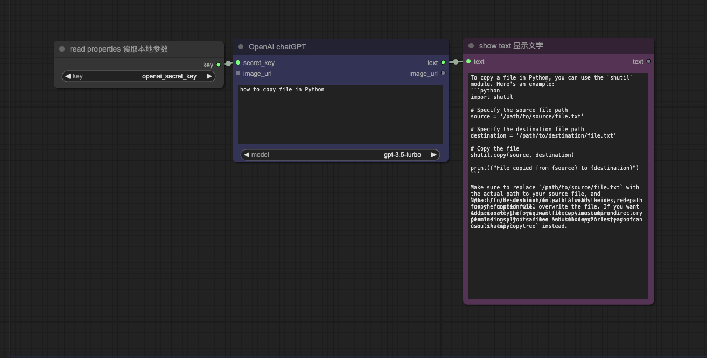
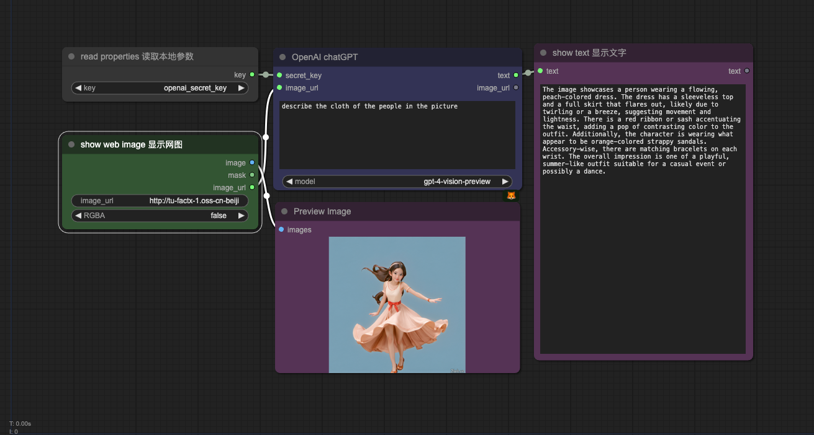
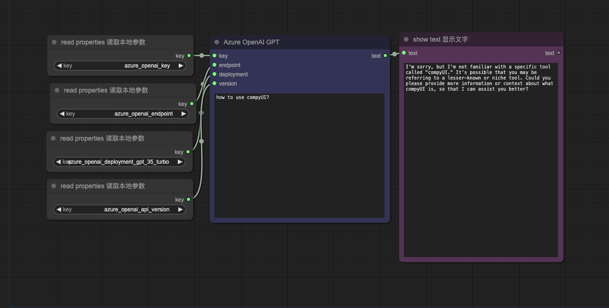
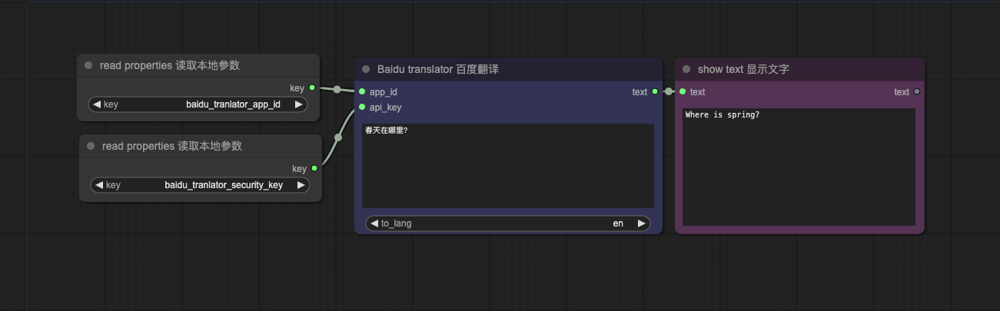
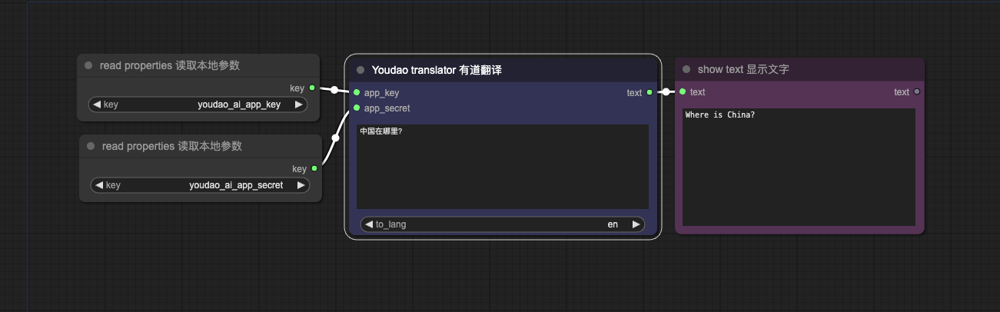

# comfyUI-api-2lab

# 项目介绍 introduction
为comfyUI集成非绘画类的能力，包括数据、算法、视频处理、大模型等，方便搭建更强大的工作流

Integrate non-painting capabilities into comfyUI, including data, algorithms, video processing, large models, etc., to facilitate the construction of more powerful workflows.

# 后台配置 properties
调用api时，一般要配置api相关的apiId和apiKey。首先，把 properties_template.json 改名为 properties.json，然后在 properties.json 中填写你在各平台的apiId和apiKey

When calling an API, it is generally necessary to configure the API-related apiId and apiKey. First, rename properties_template.json to properties.json, and then fill in your apiId and apiKey for each platform in properties.json.

# 参数输入 parameter Input
所有节点都同时允许前台和后台输入apiId和apiKey
- 前台：在comfyui节点上输入apiId和apiKey，优点是使用方便
- 后台：在properties.py中填写apiId和apiKey，优点是分享workflow时不会泄露apiId和apiKey

All nodes allow the input of apiId and apiKey from both the frontend and backend:
- Frontend: Enter the apiId and apiKey on the comfyui node, with the advantage being ease of use.
- Backend: Fill in the apiId and apiKey in properties.py, with the advantage being that the apiId and apiKey will not be exposed when sharing the workflow.

# 技术依赖 Dependencies
## ChatGLM
pip install zhipuai
## openAI & Azure OpenAI
pip install openai
### Azure
需要在Azure OpenAI Studio中预先注册和配置deployment (https://oai.azure.com/portal)

You need to register and configure the deployment in Azure OpenAI Studio (https://oai.azure.com/portal).

# 例子 example
见workflow目录

See the workflow directory

## GPT3.5

## GPT4 vision

## Azure GPT3.5

## 百度翻译 baidu translator

## 有道翻译 youdao translator
